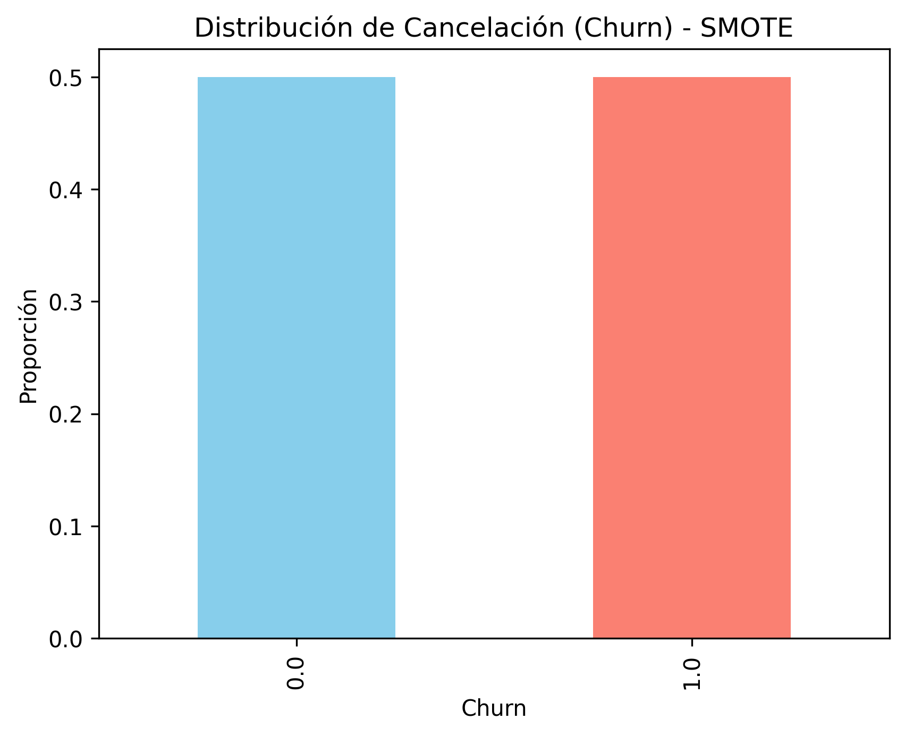

<h1 align="center">📊 Predicción de Cancelación de Clientes (Churn) en Telecomunicaciones</h1>

<p align="center">
<b>Proyecto de Machine Learning para la predicción de churn en una empresa de telecomunicaciones</b>
</p>

---

## Índice

- [Índice](#índice)
- [Vista Previa](#vista-previa)
- [🎯 Objetivo](#-objetivo)
- [📁 Estructura del Proyecto](#-estructura-del-proyecto)
- [📦 Instalación](#-instalación)
- [📝 Uso](#-uso)
- [📊 Ejemplo de Uso](#-ejemplo-de-uso)
- [📈 Visualizaciones](#-visualizaciones)
- [🛠️ Dependencias Principales](#️-dependencias-principales)
- [📂 Créditos](#-créditos)
- [📝 Licencia](#-licencia)

---

## Vista Previa

<table>
	<tr>
		<td align="center"><br>Matriz de Confusión</td>
		<td align="center"><br>Importancia de Variables</td>
		<td align="center"><br>Distribución Churn</td>
	</tr>
</table>

---

## 🎯 Objetivo

Desarrollar modelos de clasificación que permitan identificar clientes en riesgo de cancelar sus servicios, facilitando la toma de decisiones estratégicas para la retención de clientes.

---

## 📁 Estructura del Proyecto

- `data/`: Datos crudos y procesados.
	- `raw/`: Datos originales.
	- `processed/`: Datos limpios y transformados.
- `notebooks/`: Jupyter Notebooks para análisis exploratorio, modelado y evaluación.
- `src/`: Scripts reutilizables para carga, limpieza, preprocesamiento y modelado.
- `reports/`: Resultados, gráficos y métricas exportadas.
- `requirements.txt`: Dependencias necesarias para reproducir el proyecto.

---

## 📦 Instalación

```bash
git clone https://github.com/AMG-AA/challenge-Telecom2-ml.git
cd challenge-Telecom2-ml
pip install -r requirements.txt
```

Opcional: crea y activa un entorno virtual:
```bash
python -m venv venv
.\venv\Scripts\activate
```

---

## 📝 Uso

1. Ejecuta los notebooks en la carpeta `notebooks/` para:
	 - Análisis exploratorio de datos (EDA)
	 - Preprocesamiento y limpieza
	 - Modelado y evaluación de modelos
2. Usa los scripts de `src/` para automatizar tareas de preprocesamiento y entrenamiento.
3. Los resultados y gráficos se guardan automáticamente en la carpeta `reports/`.

---

## 📊 Ejemplo de Uso

```python
# Entrenamiento de un modelo
from src.train_models import entrenar_modelo
modelo = entrenar_modelo('data/processed/telecom_df_bin.csv')

# Predicción con nuevos datos
from src.data_preprocessing import preprocesar_datos
nuevos_datos = preprocesar_datos('data/raw/nuevos_clientes.csv')
predicciones = modelo.predict(nuevos_datos)
print(predicciones)
```

---

## 📈 Visualizaciones

El proyecto incluye visualizaciones con Matplotlib, Seaborn y Plotly:

- Histogramas y boxplots de variables clave
- Matriz de correlación
- Matriz de confusión de modelos
- Importancia de variables
- Distribución de churn

---

## 🛠️ Dependencias Principales

- Python 3.8+
- pandas
- numpy
- scikit-learn
- xgboost
- matplotlib
- seaborn
- plotly
- kaleido

Consulta `requirements.txt` para la lista completa.

---

## 📂 Créditos

- Autor: AMG-AA
- Datos: [Fuente pública de telecomunicaciones](https://www.kaggle.com/blastchar/telco-customer-churn) (o la fuente que corresponda)
- Inspiración: Oracle Next Education

---

## 📝 Licencia

Este proyecto está bajo la Licencia MIT. Consulta el archivo `LICENSE` para más detalles.